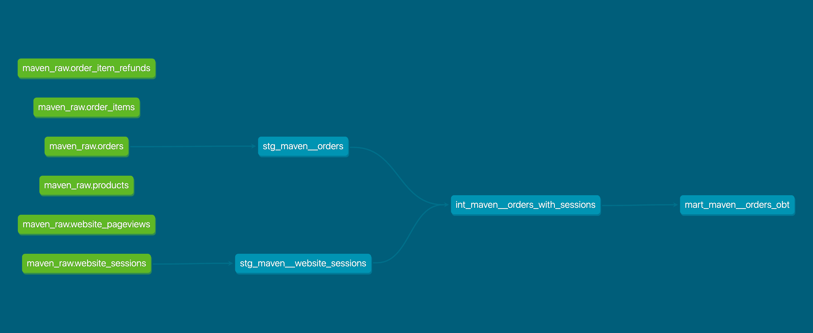

# Tarea 5 - Proyecto dbt con arquitectura por capas

## Descripción

Este repositorio contiene la solución de la **Tarea 5** del módulo de **Integración de Datos**, cuyo objetivo fue construir un proyecto **dbt** completo a partir de datos cargados desde archivos CSV del caso **Maven Fuzzy Factory**.

El proyecto fue desarrollado siguiendo una arquitectura de tres capas:

- **staging**
- **intermediate**
- **mart**

Además, se configuraron las fuentes (`sources`), pruebas de calidad (`data tests`) y la documentación del proyecto con `dbt docs`.

---

## Objetivo de la tarea

Construir un proyecto dbt que cumpla con los siguientes puntos:

1. Proyecto dbt inicializado y configurado  
2. Al menos 2 modelos staging  
3. Al menos 1 modelo intermediate  
4. Al menos 1 modelo mart  
5. Archivo `_sources.yml` configurado  
6. Captura del DAG generado por `dbt docs`  

---

## Tecnologías utilizadas

- **dbt Core**
- **dbt-duckdb**
- **DuckDB / MotherDuck**
- **Git**
- **GitHub**

---

## Fuente de datos

Se trabajó con el dataset **Maven Fuzzy Factory**, compuesto por los siguientes archivos CSV:

- `orders.csv`
- `website_sessions.csv`
- `order_items.csv`
- `order_item_refunds.csv`
- `products.csv`
- `website_pageviews.csv`

Estas tablas fueron cargadas en la base `airbyte_curso_gv`, dentro del esquema:

- `raw_maven`

---

## DAG generado con dbt docs

DAG del proyecto

A continuación se presenta la captura del DAG generado con dbt docs, donde se observa el flujo de dependencias entre fuentes, modelos staging, modelo intermediate y modelo mart.



---

## Estructura del proyecto

```text
tarea5_maven/
├── dbt_project.yml
├── README.md
├── dag_tarea5_maven.png
├── models/
│   ├── staging/
│   │   └── maven/
│   │       ├── _sources.yml
│   │       ├── _staging_models.yml
│   │       ├── stg_maven__orders.sql
│   │       └── stg_maven__website_sessions.sql
│   ├── intermediate/
│   │   └── maven/
│   │       ├── _intermediate_models.yml
│   │       └── int_maven__orders_with_sessions.sql
│   └── marts/
│       └── maven/
│           ├── _mart_models.yml
│           └── mart_maven__orders_obt.sql

---

## Arquitectura de modelos
1. Staging

En esta capa se definieron los modelos base a partir de las tablas fuente, realizando renombrado y organización inicial de columnas.

##Modelos implementados:

stg_maven__orders

stg_maven__website_sessions

2. Intermediate

En esta capa se construyó un modelo intermedio para integrar información de pedidos y sesiones web.

## Modelo implementado:

int_maven__orders_with_sessions

3. Mart

En esta capa se construyó una tabla final orientada al análisis, con una vista consolidada de órdenes y datos de sesión.

## Modelo implementado:

mart_maven__orders_obt

Sources configurados

## El proyecto utiliza el archivo:

models/staging/maven/_sources.yml

con la definición de las tablas fuente dentro del esquema raw_maven.

## Fuentes declaradas:

orders

website_sessions

order_items

products

website_pageviews

order_item_refunds

## Tests implementados

Se configuraron pruebas de calidad sobre columnas clave, principalmente:

not_null

unique

## Estas pruebas fueron aplicadas sobre:

order_id

website_session_id

## La ejecución de pruebas se realizó con:

dbt test

## Ejecución del proyecto
1. Validar configuración
dbt debug
2. Ejecutar modelos de staging
dbt run --select path:models/staging
3. Ejecutar modelos intermedios
dbt run --select path:models/intermediate
4. Ejecutar modelo mart
dbt run --select path:models/marts
5. Ejecutar pruebas
dbt test
6. Generar documentación
dbt docs generate
7. Visualizar documentación y DAG
dbt docs serve
## Resultado

El proyecto cumple con los requerimientos de la tarea:

proyecto dbt configurado correctamente

2 modelos staging

1 modelo intermediate

1 modelo mart

archivo _sources.yml implementado

pruebas ejecutadas correctamente

